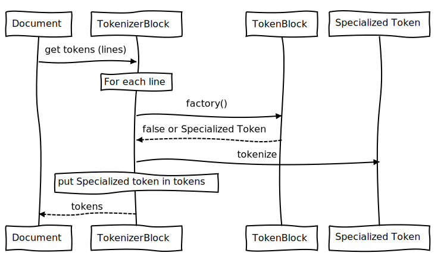

# Vischio Markdown

Vischio is a simple, modern, and hackable C++ Markdown library. 

This Markdown library:

- Can be used in a C++ project
- Can produce other things than HTML,
- Can process custom formatting.

Vischio is a "port" of Python's [Mistletoe](https://github.com/miyuchina/mistletoe) library with bits (or better some inspiration) from the "oldish" C++/Boost [sevenjay/cpp-markdown](https://github.com/sevenjay/cpp-markdown)

## Sequence diagram


<details><summary>Source</summary>

```
Document->TokenizerFile: get lines
TokenizerFile-->Document: lines
Document->TokenizerFile: normalize lines
TokenizerFile-->Document: lines
Document->TokenizerBlock: get tokens
TokenizerBlock-->Document: tokens 
```

</details>



<details><summary>Source</summary>

```
Document->TokenizerBlock: get tokens (lines)
Note over TokenizerBlock: For each line
TokenizerBlock->TokenBlock: factory()
TokenBlock-->TokenizerBlock:false or Specialized Token
TokenizerBlock->Specialized Token: tokenize
Note over TokenizerBlock: put Specialized token in tokens
TokenizerBlock-->Document: tokens
```

</details>


## Status

This project is still in its starting blocks and is not usable.

Currently :

- i'm trying to implement the list block items (with block children). i'm currently trying to get the children to be a variant. i have the structure (i think) but, now i have to correctly take out the items from the vector.
- the p and h token get all the way from the parser to the renderer...
- the `<em>` is the first inline block to be processed.
- use it as `vischio input.md`
- next steps:
  - get catch to work and create the unit tests for `<em>`
  - add other inline items
  - find out how to get the lists to work (block children in block item)
  - get he `<br>` to work.
- `cmake/FindCatch.cmake` now somehow works, but:
  - it does not "find" Catch after downloading it (you have to re-download it)
  - i cannot set noexecpt and std-11 as a minimum without removing the original settings for the project from the `CMakeLists.txt`.

## Notes

On the road to creating this library I've had a look at:

- https://www.pell.portland.or.us/~orc/Code/discount/
([a usage sample](https://stackoverflow.com/questions/26563524/parsing-markdown-with-c-discount-library))
- [mkdio.h++](https://gist.github.com/Orc/97b5711dd8c8a3b371928db756eba6e5): a c++ header for discount. 
- https://github.com/goldsborough/markdownpp (it probably just uses hoedown)
- [Notes.CC](https://github.com/DaveDavenport/Notes.CC), using libmarkdown2 to convert markdown to html.

Some input:

- [cmake and libraries](https://stackoverflow.com/questions/17511496/how-to-create-a-shared-library-with-cmake)
- https://stackoverflow.com/questions/11217800/building-library-with-cmake
- [Factories](https://stackoverflow.com/questions/5120768/how-to-implement-the-factory-method-pattern-in-c-correctly)
- [Creating a Header-Only Library with CMake](http://www.mariobadr.com/creating-a-header-only-library-with-cmake.html)

Online testing of the Github Markdown:

- http://tmpvar.com/markdown.html
- or just use atom + ctrl-shift-m
- liuq proposal for a new logo was not really accepted:
  - https://github.com/liuq/mistletoe/blob/55b22f802533bc256504d28b64745a521772b926/resources/logo.svg
  - personally, i like it... without the ribbon, of course.


## Todo

- improve the catching of out of range in the htmlrender when it does not find a matching render for the block type (output to standard error?)
- remove the construrs without paramers (now we have static factories)
- make sure that empth does not accept strong elements
- do not run tests on make but on `cmake test` (and `cmake all`)
- do not stop making if tests fail
- For the list we will probably need a common ancestor for inline and block elements...
- At the end, i would like to check if it would be possible to have the tokens as `unique_ptr`s, insteald of `shared_ptr`s.
- UML?
  - dia + autodia
  - doxygen?
    - https://codeyarns.com/2014/06/18/how-to-configure-doxygen-for-c-code/
    - https://stackoverflow.com/questions/4755913/how-to-use-doxygen-to-create-uml-class-diagrams-from-c-source
  - what about creating a c++ to dia based on clang?
    - based on http://cpp2dia.sourceforge.net/ ? but i would need cvs to get the code...
  - bouml? (but it does not seem to be free software)
  - https://github.com/ruben2020/tags2uml
  - sequence diagrams?
    - https://bramp.github.io/js-sequence-diagrams/
    - <https://en.wikipedia.org/wiki/Sequence_diagram>
- We might want to make `Document` non copyable:

  ```cpp
  class Document
  {
      public:
          Document() = default;
          Document(std::ifstream& markdownFile) {
          }
          Document(const Document&) = delete; // non copiable
          Document & operator=(const Document&) = delete; // non copiable
      private:
          std::vector<std::shared_ptr<Token>> tokens;
  };
  ```
