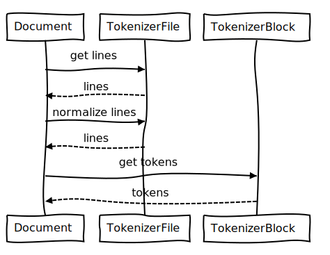

# Vischio Markdown

Vischio is a simple, modern, and hackable C++ Markdown library. 

This Markdown library:

- Can be used in a C++ project
- Can produce other things than HTML,
- Can process custom formatting.

Vischio is a "port" of Python's [Mistletoe](https://github.com/miyuchina/mistletoe) library with bits of the the "oldish" C++/Boost [sevenjay/cpp-markdown](https://github.com/sevenjay/cpp-markdown)

## Sequence diagram



<details><summary>Source</summary>
```
Document->TokenizerFile: get lines
TokenizerFile-->Document: lines
Document->TokenizerFile: normalize lines
TokenizerFile-->Document: lines
Document->TokenizerBlock: get tokens
TokenizerBlock-->Document: tokens 
```
</details>


## Status

This project is still in its starting blocks and is not usable.

Currently :

- the p and h token get all the way from the parser to the renderer...
- next step is to get the span items to be processed (em).
  - the structure for the inline tokens is created... the heading starts collecting children: the code compiles but the inline children are not processed yet.
- it only processes a "input.md" file that must be placed next to the executable.

## Notes

On the road to creating this library I've had a look at:

- https://www.pell.portland.or.us/~orc/Code/discount/
([a usage sample](https://stackoverflow.com/questions/26563524/parsing-markdown-with-c-discount-library))
- [mkdio.h++](https://gist.github.com/Orc/97b5711dd8c8a3b371928db756eba6e5): a c++ header for discount. 
- https://github.com/goldsborough/markdownpp (it probably just uses hoedown)
- [Notes.CC](https://github.com/DaveDavenport/Notes.CC), using libmarkdown2 to convert markdown to html.

Some input:

- [cmake and libraries](https://stackoverflow.com/questions/17511496/how-to-create-a-shared-library-with-cmake)
- https://stackoverflow.com/questions/11217800/building-library-with-cmake
- [Factories](https://stackoverflow.com/questions/5120768/how-to-implement-the-factory-method-pattern-in-c-correctly)

## Todo

- Unit tests?
- UML?
  - dia + autodia
  - doxygen?
    - https://codeyarns.com/2014/06/18/how-to-configure-doxygen-for-c-code/
    - https://stackoverflow.com/questions/4755913/how-to-use-doxygen-to-create-uml-class-diagrams-from-c-source
  - what about creating a c++ to dia based on clang?
    - based on http://cpp2dia.sourceforge.net/ ? but i would need cvs to get the code...
  - bouml? (but it does not seem to be free software)
  - https://github.com/ruben2020/tags2uml
- We might want to make `Document` non copyable:

  ```cpp
  class Document
  {
      public:
          Document() = default;
          Document(std::ifstream& markdownFile) {
          }
          Document(const Document&) = delete; // non copiable
          Document & operator=(const Document&) = delete; // non copiable
      private:
          std::vector<std::shared_ptr<Token>> tokens;
  };
  ```
